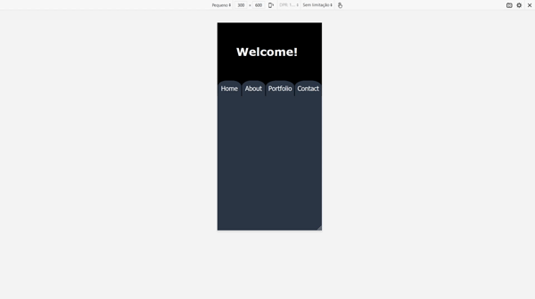

# my-portfolio-v2-cancelled
<!-- PROJECT LOGO -->
<br />
<p align="center">
  

  <h3 align="center">Portfolio Webpage</h3>

  <p align="center">
    A page to display my work. First try at NextJS
    <br />
    <br />
  </p>
</p>


<!-- TABLE OF CONTENTS -->
<details open="open">
  <summary>Table of Contents</summary>
  <ol>
    <li><a href="#prerequisites">Prerequisites</a></li>
    <li><a href="#running">Running</a></li>
    <li><a href="#contact">Contact</a></li>
  </ol>
</details>


<!-- ABOUT THE PROJECT -->
## About The Project

<p align="center">
  
</p>

I tried many things in the production, in the end i realised that the ideas were not quite matching the style I wanted so I decided to leave the project as is.

## Prerequisites
It is need to install some tools, Click on the link to see the ones I used to run with Windows O.S.
<br/>
[Link](https://github.com/MestreALMO/React-Requires-To-Run-Windows-)


## Running

### First time

When running for the first time we need to run the following code in a terminal inside the project folder, so the project download the library that it uses

```
yarn
```

### Second or more times

In a terminal inside the project folder use the code:

```
yarn dev
```

With that the app will be running!!!


## Contact

My Name: André Lusegardis Miranda de Oliveira

  * lusegardis@gmail.com

  * [LinkedIn](https://www.linkedin.com/in/andr%C3%A9-lusegardis/)

  * [GitHub](https://github.com/MestreALMO)
